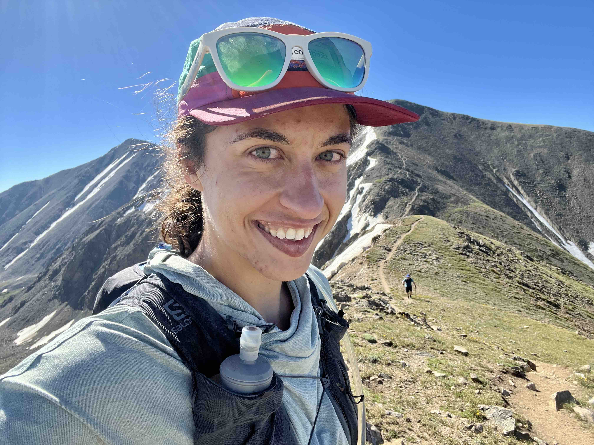
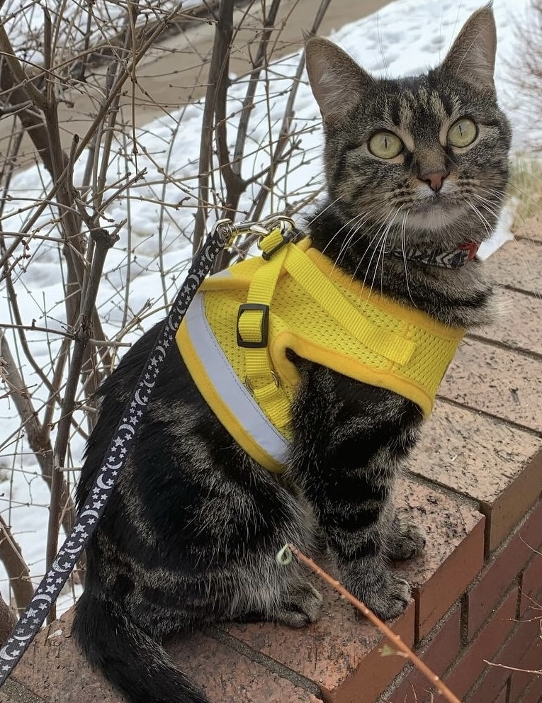
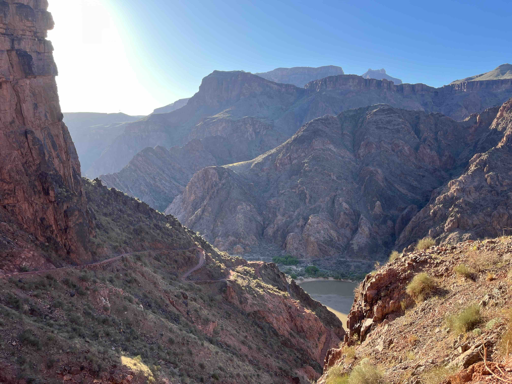
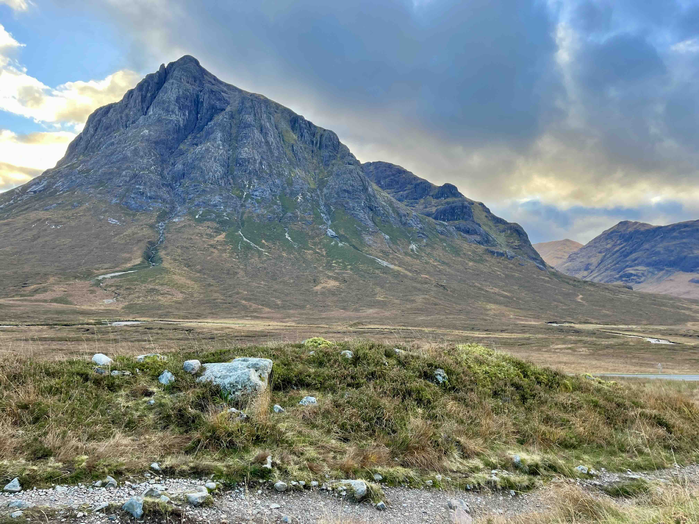

## **About Me**  

Jasmine Garland is a Chancellor's Postdoctoral Research Fellow in the Department of Civil, Environmental, and Architectural Engineering at the University of Colorado Boulder. She is also a member of the Power Systems Modeling Group at Pacific Northwest National Laboratory (PNNL), where she collaborates on advancing computational methods for power system planning and operations. She earned her PhD from the University of Colorado Boulder, where she was supported by the National Science Foundation Graduate Research Fellowship (NSF GRFP), the Graduate Assistance in Areas of National Need (GAANN) Fellowship, the U.S. Department of Energy Innovation in Buildings (IBUILD) Fellowship, and the Temple Hoyne Buell Endowed Ambassadorial Scholarship.

Jasmine's research is at the confluence of climate science, artificial intelligence, optimization, and electric power systems. She develops data-driven and physics-informed methods to improve the resilience, reliability, and sustainability of electric power systems under a changing climate. Her work integrates machine learning, uncertainty quantification, optimization, and power system modeling to address challenges caused by extreme weather, wildfires, renewable energy integration, and evolving electricity demand. Her goal is to develop decision-support tools that enable utilities and system operators to reach informed planning and operational decisions in the face of increasing climate uncertainty.

As part of her doctoral training, Jasmine was an Academic Guest in Professor Gabriela Hug's Power Systems and High Voltage Laboratory at ETH Zürich, where she conducted research on power system operations and modeling under different climate scenarios. This experience strengthened her interdisciplinary and international perspective on resilient energy systems.

Before joining CU Boulder, Jasmine earned her bachelor's degree from Appalachian State University, where she conducted research on HVAC control systems. She then joined the Certification and Research Team at the Passive House Institute US (PHIUS), contributing to research on building energy modeling software and method development. Prior to beginning graduate school, she spent two years at the National Laboratory of the Rockies (formerly National Renewable Energy Laboratory), where she specialized in data analytics and machine learning.

Jasmine's long-term vision is to lead an interdisciplinary research group that develops innovative computational tools for climate-resilient energy systems, translating advances in artificial intelligence, optimization, and power system science into solutions that improve the reliability, affordability, and sustainability of critical energy infrastructure.

  <!-- First image with caption -->
  <figure style="margin: 0 0 15px 0; line-height: 1.2;">
    
    <figcaption style="font-size: 0.62em; text-align: center; color: #666; margin-top: 2px;">
      Jasmine's cat Prisma
    </figcaption>
  </figure>
  
  <!-- Second image with caption -->
  <figure style="margin: 0 0 15px 0; line-height: 1.2;">
    
    <figcaption style="font-size: 0.62em; text-align: center; color: #666; margin-top: 2px;">
      Running R2R2R of the Grand Canyon
    </figcaption>
  </figure>
  
  <!-- Third image with caption -->
  <figure style="margin: 0 0 15px 0; line-height: 1.2;">
    
    <figcaption style="font-size: 0.62em; text-align: center; color: #666; margin-top: 2px;">
      Fast-packing the Scottish Highlands
    </figcaption>
  </figure>

## **Personal**  

Raised in Bakersville, NC, Jasmine currently resides in Boulder, CO, with her cat, Prisma. Her passion for energy and climate research is deeply connected to her love of the outdoors. Outside of academia, she enjoys mountain and trail ultra-running, often taking on 100-mile races and long self-supported challenges. The discipline, resilience, and mental clarity she finds in running reflect the same qualities she brings to her research. She hopes to inspire more women and girls to explore mountain sports and endurance athletics.

She is also deeply committed to promoting inclusion and diversity in higher education, particularly in engineering. As a woman and first-generation college student from a rural, low-income background, she advocates for greater accessibility and equity in STEM and energy education. Jasmine has served as an instructor for an undergraduate course, and she actively mentors students both formally and informally. She also participates in outreach efforts aimed at engaging underserved communities in science and engineering. Her lived experiences continue to inform her dedication to fostering supportive, inclusive environments for underrepresented voices in STEM.

