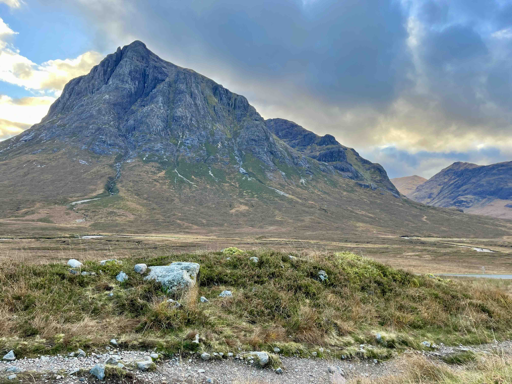

## **About Me**  

Jasmine Garland is a PhD candidate at the University of Colorado Boulder in the Department of Civil, Environmental, and Architectural Engineering. She is a recipient of the National Science Foundation Graduate Research Fellowship (NSF GRFP), the Graduate Assistant in Areas of National Need (GAANN) Fellowship, the U.S. Department of Energy Innovation in Buildings (IBuild) Fellowship, and the Temple Hoyne Buell Endowed Ambassadorial Scholarship. Co-advised by Dr. Kyri Baker and Dr. Ben Livneh, her research focuses on the intersection of climate change, extreme weather events, and the power grid, blending her passions for data science, mathematical modeling, and energy systems. She aspires to become a professor leading a diverse research group dedicated to solving critical energy challenges through both simulation and real-world application.

Currently, she is serving as an academic guest at ETH Zurich, collaborating with Professor Gabriela Hug’s Power Systems and High Voltage Lab, which specializes in power systems, renewable energy integration, and advanced grid control. This experience continues to broaden her expertise in international and interdisciplinary energy research.   

Before joining CU Boulder, Jasmine earned her undergraduate degree from Appalachian State University, where she conducted research on HVAC control systems. She was part of the Certification and Research Team at the Passive House Institute United States (PHIUS), contributing to building energy modeling software research and method development. Most recently, she spent two years at the National Renewable Energy Laboratory (NREL) in Golden, Colorado, specializing in data analytics and data modeling.

  <!-- First image with caption -->
  <figure style="margin: 0 0 20px 0; line-height: 1.2;">
    
    <figcaption style="font-size: 0.55em; text-align: center; color: #666; margin-top: 2px;">
      Jasmine's cat Prisma
    </figcaption>
  </figure>

  <!-- Second image with caption -->
  <figure style="margin: 0 0 20px 0; line-height: 1.2;">
    
    <figcaption style="font-size: 0.55em; text-align: center; color: #666; margin-top: 2px;">
      Running R2R2R of the Grand Canyon
    </figcaption>
  </figure>

  <!-- Third image with caption -->
  <figure style="margin: 0; line-height: 1.2;">
    
    <figcaption style="font-size: 0.55em; text-align: center; color: #666; margin-top: 2px;">
      Fast-packing the Scottish Highlands
    </figcaption>
  </figure>

## **Personal**  

Raised in Bakersville, NC, Jasmine currently resides in Zurich, Switzerland, with her cat, Prisma. Her passion for energy and climate research is deeply connected to her love of the outdoors. Outside of academia, she enjoys mountain and trail ultra-running, often taking on 100-mile races and long self-supported challenges. The discipline, resilience, and mental clarity she finds in running reflect the same qualities she brings to her research. She hopes to inspire more women and girls to explore mountain sports and endurance athletics.

She is also deeply committed to promoting inclusion and diversity in higher education, particularly in engineering. As a woman and first-generation college student from a rural, low-income background, she advocates for greater accessibility and equity in STEM and energy education. Jasmine has served as an instructor for an undergraduate course, and she actively mentors students both formally and informally. She also participates in outreach efforts aimed at engaging underserved communities in science and engineering. Her lived experiences continue to inform her dedication to fostering supportive, inclusive environments for underrepresented voices in STEM.

