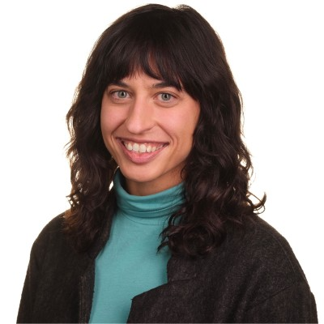

# Welcome!

I'm **Jasmine**, a PhD student at the University of Colorado Boulder and a visiting researcher at **ETH Zürich's Energy Science Center – Power Systems and High Voltage Lab**.  

My research focuses on advancing **data-driven optimization** and **machine learning** methods to address complex challenges in power systems and support the transition to a more resilient and sustainable energy future.

You can learn more about my background and current projects in the [About Me](https://jasminegarland.github.io/about) and [Research](https://jasminegarland.github.io/research) sections.
For reflections on life abroad, ultra-running, and topics at the intersection of energy and the environment, head over to the [Blog](https://jasminegarland.github.io/blog/). _Please note, this website is intented for use on a desktop computer._

Thanks for visiting – I’m glad you’re here!
