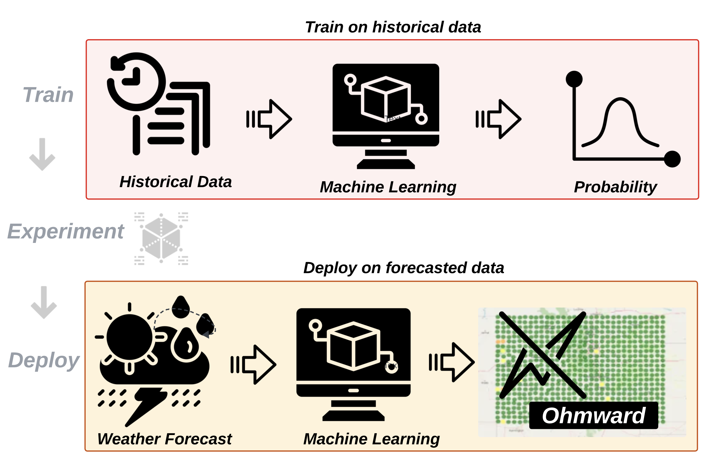

## **Research Overview**

  <!-- First image with caption -->
  <figure style="margin: 0 0 30px 0; line-height: 1.2;">
    
    <figcaption style="font-size: 0.62em; text-align: center; color: #666; margin-top: 2px;">
      Power Outage Forecasting Tool: Ohmward
    </figcaption>
  </figure>

<!-- Second image with caption -->
<figure style="margin: 0 0 30px 0; line-height: 1.2; margin-left: auto; text-align: right;">
  
  <figcaption style="font-size: 0.62em; text-align: center; color: #666; margin-top: 2px;">
    The Bi-Directional Impacts of Climate Change and the Power Sytem
  </figcaption>
</figure>

<!-- Third image with caption -->
<figure style="margin: 0 0 30px 10%; line-height: 1.2; display: flex; flex-direction: column; align-items: flex-end;">
  
  <figcaption style="font-size: 0.62em; text-align: center; color: #666; margin-top: 2px; width: 100%;">
    Machine Learning for Pattern Recognition
  </figcaption>
</figure>

My research lies at the intersection of **climate adaptation, energy systems modeling, and machine learning**. I develop data-driven tools and power grid simulation methods to better understand how electric power systems can withstand and adapt to increasing climate-related stress.

My dissertation focuses on three core challenges:

### 1. Climate-Driven Grid Disruptions  
I use machine learning models—including deep neural networks, recurrent neural networks, and transformers—to forecast where and when weather-induced power outages are likely to occur, as well as to estimate outage durations. These predictive tools support utilities and planners in preparing for increasingly frequent and severe disruptions caused by extreme weather.

### 2. Resilient and Low-Carbon Grid Planning  
I integrate capacity expansion modeling, realistic power flow simulations (incorporating grid topology and dispatch algorithms), and carbon accounting to explore how grid infrastructure can evolve under climate change. My research examines the role of diverse energy resources and climate scenarios in shaping future grid development. I also evaluate how operational algorithms—such as dispatch strategies and software updates—impact emissions and system reliability, highlighting opportunities for emissions reduction through improved grid control and optimization methods.

### 3. Energy Burden and Frontline Communities  
Using unsupervised learning techniques such as Self-Organizing Maps (SOMs), I investigate spatial and demographic patterns of energy burden to identify communities disproportionately affected by high energy costs and climate-related outages. This work supports more equitable energy planning. In parallel, I apply supervised learning approaches to identify key indicators for predicting household energy burden.

By combining **machine learning**, **grid optimization**, and **climate data**, my research aims to support the development and operation of climate-responsive power systems that are both technically robust and socially equitable.

---

I am seeking postdoctoral research opportunities beginning in **Fall 2026** in the following areas:

- Power system operation, control, and planning  
- Renewable energy integration  
- Machine learning for energy systems  
- Energy sustainability and resilience  

Research updates and publications are available on this page. You can view my [ORCID profile](https://orcid.org/0000-0002-7966-8462) or [Google Scholar page](https://scholar.google.com/citations?user=KzpIf14AAAAJ&hl=en) for a complete list of papers.

## **Publications**
_Note: A "\*" indicates an undergraduate student I mentored._

**Garland, J.**, Baker, K., & Livneh, B. (2024). *The climate-energy nexus: A critical review of power grid components, extreme weather, and adaptation measures.* *Environmental Research: Infrastructure and Sustainability*, 4(3), 032002. [https://doi.org/10.1088/2634-4505/ad79dd](https://doi.org/10.1088/2634-4505/ad79dd)

**Garland, J.**, Baker, K., Rajagopalan, B., & Livneh, B. (2025). *Exploring the importance of environmental justice variables for predicting energy burden in the contiguous United States.* *Cell Press: iScience*, 28(6), 112559. [https://doi.org/10.1016/j.isci.2025.112559] (https://doi.org/10.1016/j.isci.2025.112559)

**Garland, J.**, Baker, K., Livneh, B., Christie, I (2025). *Towards Proactive Grid Management: Weather-Aware Predictions for Power Disruptions. 2025 IEEE PES Innovative Smart Grid Technologies Europe 2025.* (**Accepted**)
 
**Garland, J.**, Baker, K., & Livneh, B. (2023). *Weather-Induced Power Outage Prediction: A Comparison of Machine Learning Models.*  
   *2023 IEEE International Conference on Communications, Control, and Computing Technologies for Smart Grids (SmartGridComm)*, 1–6. [https://doi.org/10.1109/SmartGridComm57358.2023.10333953](https://doi.org/10.1109/SmartGridComm57358.2023.10333953)

Winner, C\*., **Garland, J.**, Crozier, C., & Baker, K. (2023). Carbon Emissions Resulting from Different Power Flow Models for Dispatch.*  
   *2023 IEEE Power & Energy Society General Meeting (PESGM)*, 1–5. [https://doi.org/10.1109/PESGM52003.2023.10252655](https://doi.org/10.1109/PESGM52003.2023.10252655)

**Garland, J.**, Windham, A., & Richardson, P. (2024). *Case Study Evaluation of HVAC Energy Usage Resulting from a Room Usage Calendar-based HVAC Scheduling Tool.* *The International Journal of Energy Management*, 6(4). ISSN: 2643-6787.

Jacoby, M., Tan, S. Y., Katanbaf, M., Saffari, A., Saha, H., Kapetanovic, Z., **Garland, J.**, Florita, A., Henze, G., Sarkar, S., & Smith, J. (2021). *WHISPER: Wireless Home Identification and Sensing Platform for Energy Reduction.*  
   *Journal of Sensor and Actuator Networks*, 10(4), 71. [https://doi.org/10.3390/jsan10040071](https://doi.org/10.3390/jsan10040071)

**Garland, J.**, Baker, K.,  Livneh, B. & Balaji, R. (2025). *Learning Energy Burden Indicators for Data-Driven Policy Using
Self-Organizing Maps*. *Environmental Research: Energy* (**Under Review**).

**Garland, J.**, Balaji, R., Baker, K., Livneh, B. (2024) *Learning the Indicators of Energy Burden for Knowledge Informed Policy* NeurIPS 2024 Workshop on Tackling Climate Change with Machine Learning.

